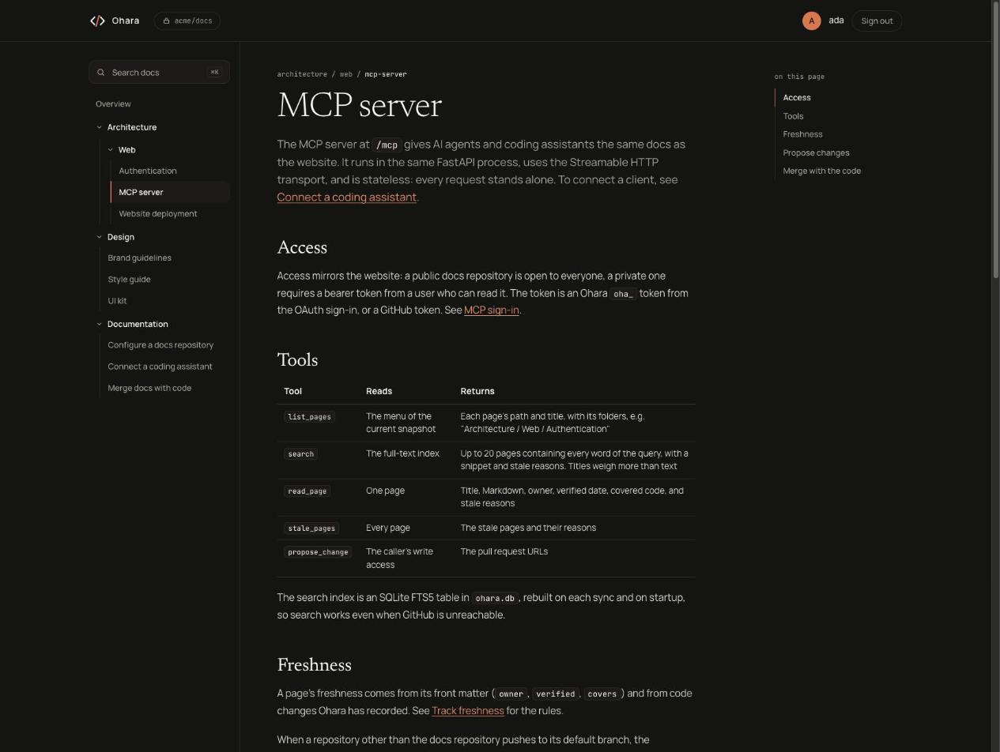

# Ohara — One place for all company knowledge, kept up to date by AI

**AI-generated, human-controlled.**

Ohara is an open-source documentation manager. It gathers your docs and engineering guidelines in one GitHub repository, gives every coding assistant the same guidelines, and updates the docs with each code change, through pull requests a human approves.



---

## Why Ohara

Ohara addresses three key challenges:

1. **Scattered knowledge.** Company knowledge is split across Jira, Confluence, GitHub, Google Drive, and Slack, with no single source of truth.
2. **Inconsistent coding assistants.** Every developer and every project configures their assistant on their own, so guidelines drift apart, and so does the code.
3. **Outdated documentation.** Docs fall behind the code because nobody owns the update step.

Ohara's answer:

- **One place for all knowledge.** Ohara imports existing docs from Jira, Confluence, GitHub, and Google Drive into a single GitHub repository. It is the single source of truth, readable by people on a website and by AI through MCP.
- **Shared guidelines for every developer and every project.** Architects write the guidelines once. `/ohara:init` connects any project's coding assistant to them in one command. Every assistant, in every repository, follows the same rules, and an update reaches everyone right away.
- **Docs that stay current.** Assistants propose doc updates with each code change, and the docs pull request merges with the code pull request. Stale pages are flagged automatically.
- **Humans approve every change.** AI writes the docs, and people review them.

All your company knowledge in one place, kept up to date by AI, so every coding assistant follows the same guidelines across every developer and project.

### Compared with other tools

| | Ohara | Wikis (Confluence, Notion) | Docs sites (Docusaurus, MkDocs) |
|---|---|---|---|
| Every change reviewed as a pull request | ✓ | | ✓ |
| Docs merge with the code change that updated them | ✓ | | |
| Pages flagged when the code they describe changes | ✓ | | |
| One command connects a project's coding assistant to shared guidelines | ✓ | | |
| Access mirrors the GitHub repository | ✓ | | |
| Open source and self-hosted | ✓ | | ✓ |

---

## Principle

Every piece of documentation is updated by AI and approved by a human.

- AI ingests, writes, and proposes.
- Humans review, approve, and merge: the docs of a code change merge with it, and guarded folders get their own review.
- Ohara is the single source of truth.

---

## Features

### Documentation as code
- All documentation stored in your GitHub repository
- Every change goes through a validation workflow
- Full history, review, and traceability
- Docs merge with the code change that updated them, except folders the team guards for review with `CODEOWNERS`
- Code repositories can keep their own docs next to the code: Ohara syncs them into the documentation repository on each push
- Configurable repository

### Freshness
- Each page can name its owner, the date a human last verified it, and the code it describes
- Pages not verified for six months are flagged as stale
- Pages are flagged when the code they describe changes
- AI assistants see which pages are stale and propose updates for review

### Multiple access layers
- **HTML** for human reading and configuration
- **MCP server** for AI agents and coding assistants

### Access control
- GitHub SSO authentication
- Website access mirrors the documentation repository:
  - Public repository: public website
  - Private repository: sign-in required, and only users with access to the repository can read the website

### Coding assistant integration
- Coding assistants access enterprise guidelines through MCP
- Assistants update technical documentation

### AI-powered ingestion
- A Claude agent imports existing documentation from external sources through MCP:
  - Jira
  - Confluence
  - GitHub
  - Google Drive
  - and more
- Imported content is submitted as pull requests for review
- Security and prompt injection review

### Project onboarding
- An MCP command configures an existing project to use the main Ohara repository as its documentation and guideline source


---

## Roadmap
- **AI chat** to ask questions about the documentation
- **Published releases**: a versioned Docker image on each release, so `docker compose up` runs Ohara without building it

---

## Commands
- `/ohara:init`: connect the active project's repository to the GitHub App, and configure the project to read the guidelines before planning, check its changes against them, and propose documentation updates after each change
- `/ohara:update`: propose documentation updates that match the active project's latest code changes
- `/ohara:ingest`: pull and rewrite existing documentation and guidelines into Ohara, as pull requests reviewed for secrets and prompt injection
- `/ohara:review`: review the active project against the documentation and guidelines, and report each violation with its guideline and location

---

## Workflow
- Architects define guidelines
- Coding assistant uses them and proposes an architecture for each new feature
- Architects and engineers review
- Coding assistant develops based on the approved plan
- Coding assistant updates the documentation
- Engineers review


---

## Getting started

1. Set `OHARA_URL` to the address people will use to open Ohara (see `.env.example`). It can include a path, such as `https://acme.com/docs`.
2. Run `docker compose up -d`.
3. Open Ohara, create the GitHub App from the setup page, and install it on your docs repository and your code repositories. Then choose the docs repository in Ohara.

Your docs repository holds plain Markdown files. Folders become the menu, and each page's first heading is its title. Optional front matter tracks freshness:

```yaml
---
owner: ada
verified: 2026-03-01
covers: [acme/api:src/billing/*]
---
```

Code repositories on the same installation flag the pages whose `covers` name them, and merge their docs pull requests with the code. A repository that opts in with a `.ohara.yml` at its root (`/ohara:init` writes one with `docs:` listing `docs`) has those docs synced one way into `apps/<repo>/` of the docs repository on each push. A private code repository is never synced into a public docs repository. Add more later in the app's installation settings on GitHub, or let `/ohara:init` open them for the project's repository. The app can write to every repository it is installed on, though in code repositories Ohara only reads their docs, which files changed, and which pull requests merged, and opens the pull requests proposed for their docs.

Connect a coding assistant to the MCP server. For a private docs repository, it opens a GitHub sign-in on first use:

```sh
claude mcp add --transport http ohara <OHARA_URL>/mcp
```

Then run `/ohara:init` in the project to set it up.

For CI and headless agents, send a GitHub token instead: `--header "Authorization: Bearer <token>"`.

Assistants read pages and propose changes. A proposal from a code branch opens one docs pull request that merges when the code is merged, and a second one for review if it touches folders with code owners. Later proposals from the same branch add to them. Other proposals open a pull request for a human to review. Proposing requires a signed-in user or a token with write access to the repository.

---

## Contributing

Contributions are welcome. Open an issue or submit a pull request.

---

## License

[Apache-2.0](LICENSE)
