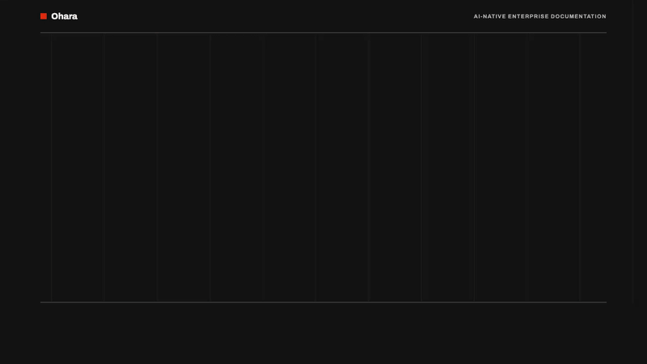
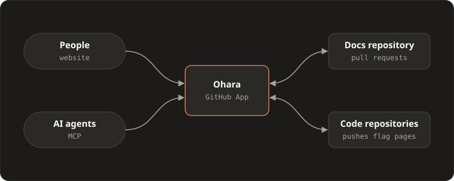

# Ohara

**One place for all company knowledge, kept up to date by AI. You approve every change.**

Ohara is an open-source documentation manager. Your docs and engineering guidelines live in one GitHub repository. People read them on a website, and AI agents read them through MCP. When the code changes, AI proposes the matching doc update as a pull request, and a human merges it.



## Why Ohara

- **Knowledge is scattered** across Confluence, Jira, Google Drive, GitHub, and Slack. Ohara imports it into one repository.
- **Every coding assistant follows different rules**, so the code drifts apart. With Ohara, architects write the guidelines once, and every assistant in every project follows them.
- **Docs fall behind the code.** With Ohara, assistants update the docs in the same change as the code, and stale pages are flagged.

## How it works



- **Docs as code.** Plain Markdown in a GitHub repository. Folders become the menu. Every change is a pull request.
- **One docs pull request per code branch**, linked from the code pull request, so reviewers see both.
- **Freshness.** Pages name their owner, their last verified date, and the code they cover. Ohara flags them when that code changes or after six months.
- **Docs next to the code.** A code repository with a `.ohara.yml` keeps its own docs, and Ohara syncs them on each push.
- **Access mirrors GitHub.** A public repository makes a public website. A private one requires GitHub sign-in, and only people who can read the repository can read the docs.
- **Self-hosted.** One Docker container, and your docs stay in your GitHub repository.

## Commands

From Claude Code, once connected to Ohara's MCP server:

| Command | What it does |
|---|---|
| `/ohara:init` | Sets up a project: the GitHub App, `.mcp.json`, and the guidelines in `CLAUDE.md` |
| `/ohara:update` | Proposes doc updates from the project's latest code changes |
| `/ohara:review` | Reviews the project against the guidelines and docs |
| `/ohara:ingest` | Imports existing docs from Confluence, Jira, Google Drive, and more, as pull requests |

## Compared with other tools

| | Ohara | Wikis (Confluence, Notion) | Docs sites (Docusaurus, MkDocs) |
|---|---|---|---|
| Every change reviewed as a pull request | ✓ | | ✓ |
| One docs pull request per code branch | ✓ | | |
| Pages flagged when the code they describe changes | ✓ | | |
| One command connects a coding assistant to shared guidelines | ✓ | | |
| Access mirrors the GitHub repository | ✓ | | |
| Open source and self-hosted | ✓ | | ✓ |

## Quick start

```sh
git clone https://github.com/ntrossat/ohara.git
cd ohara
cp .env.example .env    # set OHARA_URL
docker compose up -d
```

Open `OHARA_URL`. The setup page creates a GitHub App: install it on your docs repository and your code repositories. Then connect your coding assistant and run `/ohara:init` in each project:

```sh
claude mcp add --transport http ohara <OHARA_URL>/mcp
```

The full documentation is in [`docs/`](docs/README.md): install, configure, use, and how it works inside.

## Roadmap

- An AI chat over the docs.
- A Compose file that runs the published image instead of building it.

## Contributing

Contributions are welcome. See [CONTRIBUTING.md](CONTRIBUTING.md), and report security issues as described in [SECURITY.md](SECURITY.md).

## License

[Apache-2.0](LICENSE)
