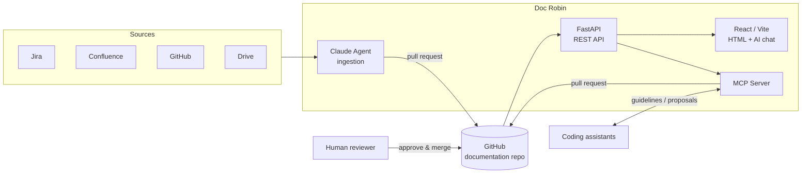

# Doc Robin

**AI-generated, human-controlled.**

Doc Robin is an open-source, unified enterprise documentation manager. It keeps all enterprise documentation and engineering guidelines in GitHub, lets AI agents generate and update them, and requires a human to approve every change.

---

## Principle

Every piece of documentation can be drafted by AI. Nothing is published without human validation.

- AI ingests, writes, and proposes.
- Humans review, approve, and merge.
- GitHub is the single source of truth.

---

## Features

### Documentation as code
- All documentation stored in your GitHub repository
- Every change goes through a validation workflow
- Full history, review, and traceability

### Multiple access layers
- **HTML** for human reading and configuration
- **REST API** for integrations
- **MCP server** for AI agents and coding assistants
- **AI chat** to ask questions about the documentation

### Coding assistant integration
- Coding assistants access enterprise guidelines through MCP
- Assistants can propose new or updated technical documentation as a pull request

### AI-powered ingestion
- A Claude agent imports existing documentation from external sources through MCP:
  - Jira
  - Confluence
  - GitHub
  - Google Drive
  - and more
- Imported content is submitted as pull requests for review

### Project onboarding
- An MCP command configures an existing project to use the main Doc Robin repository as its documentation and guideline source

---

## Architecture

---

## Tech stack

| Layer | Technology |
|---|---|
| Agents | Claude Agent SDK |
| Backend | Python, FastAPI |
| Frontend | React, Vite |
| Storage | GitHub |
| Agent interface | MCP |

---

## Getting started

> Installation instructions coming soon.

---

## Contributing

Contributions are welcome. Open an issue or submit a pull request.

---

## License

TBD

