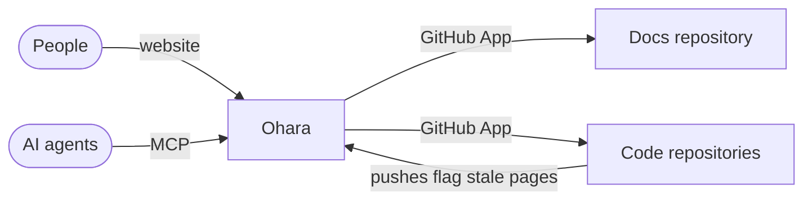

# Ohara

Ohara is an open-source documentation manager. It serves the Markdown docs of one GitHub repository to people on a website and to AI agents through MCP. AI proposes every change as a pull request, and a human merges it.

## How it works



1. **Docs repository.** Plain Markdown files in one GitHub repository are the source of truth. The folder tree is the menu, and a page's first heading is its title. See [Docs repository](configure/docs-repository.md).
2. **Two ways to read.** The website at `OHARA_URL` is for people. The MCP server at `OHARA_URL/mcp` is for AI agents. Both serve the same pages with the same access rules.
3. **Proposals.** AI never edits the docs directly. An agent calls `propose_change`, and Ohara's GitHub App opens a pull request on the docs repository. A proposal from a code branch, such as `feature/billing` in `api`, goes to one pull request on the `api/feature/billing` branch, which the code pull request links to.
4. **Freshness.** Front matter says who owns a page, when it was last verified, and which code it covers. A page is stale when it is unverified for 180 days, or when a push changes the code it covers. Merging a proposal verifies the page.
5. **Docs that live with the code.** A code repository with a `.ohara.yml` keeps its docs next to the code. Ohara syncs them into `apps/<repository>/` on each push, without committing them to the docs repository. See [Code repositories](configure/code-repositories.md).

```yaml
---
owner: ada
verified: 2026-03-01
covers: [acme/api:src/billing/*]
---
```

## The GitHub App

Each instance creates its own GitHub App during setup, and you install it on the docs repository and on the code repositories Ohara should follow. The app signs people in, downloads the docs repository, receives push and installation events through a webhook, and opens the pull requests that agents propose.

## Access

Access mirrors the docs repository. A public repository makes a public website. A private one requires GitHub sign-in, and only people who can read the repository can read the docs, checked again every 5 minutes. The MCP server follows the same rules. See [Access](configure/access.md).

## Glossary

| Term | Meaning |
|---|---|
| Docs repository | The GitHub repository Ohara reads its pages from |
| Code repository | Any other repository the GitHub App is installed on |
| Snapshot | Ohara's local copy of the docs repository's default branch |
| Proposal | A change sent through `propose_change`, which becomes a pull request |
| Stale page | A page verified more than 180 days ago, or whose covered code changed since it last changed |
| Synced page | A page under `apps/`, copied from a code repository |
| Guideline | A page that sets engineering rules, such as the API style or the design system |

## Where to go next

| I want to | Read |
|---|---|
| Install Ohara | [Install](install/README.md) |
| Run it in production | [Operate](install/operate.md) |
| Lay out the docs repository | [Docs repository](configure/docs-repository.md) |
| Connect code repositories | [Code repositories](configure/code-repositories.md) |
| Control who reads the docs | [Access](configure/access.md) |
| Connect a coding assistant | [Coding assistants](use/coding-assistants.md) |
| Ask questions from claude.ai or ChatGPT | [Chat apps](use/chat-apps.md) |
| Set up the team workflow | [Team workflow](use/team-workflow.md) |
| Understand the internals | [Architecture](developers/architecture.md) |
| Change or extend Ohara | [Customize](developers/customize.md) |
| Contribute | [Development](developers/development.md) |
